# PokéMeta

App Expo (React Native + TypeScript) para **Pokémon Champions**: Pokédex del roster oficial (~184 especies), meta competitivo y utilidades.

## Capturas y secciones de la app

Pantalla principal con acceso a todos los modos, búsqueda global y datos de [PokeAPI](https://pokeapi.co) + [data.pkmn.cc](https://data.pkmn.cc).

### Inicio

| Cabecera, búsqueda y primeros modos | Más modos de juego |
|:---:|:---:|
| 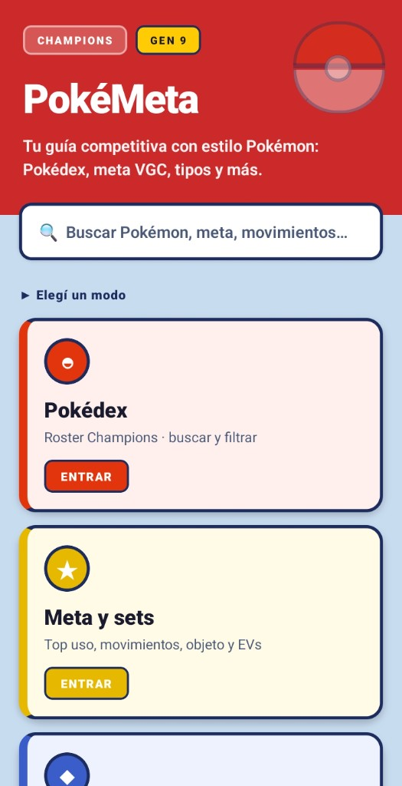 | 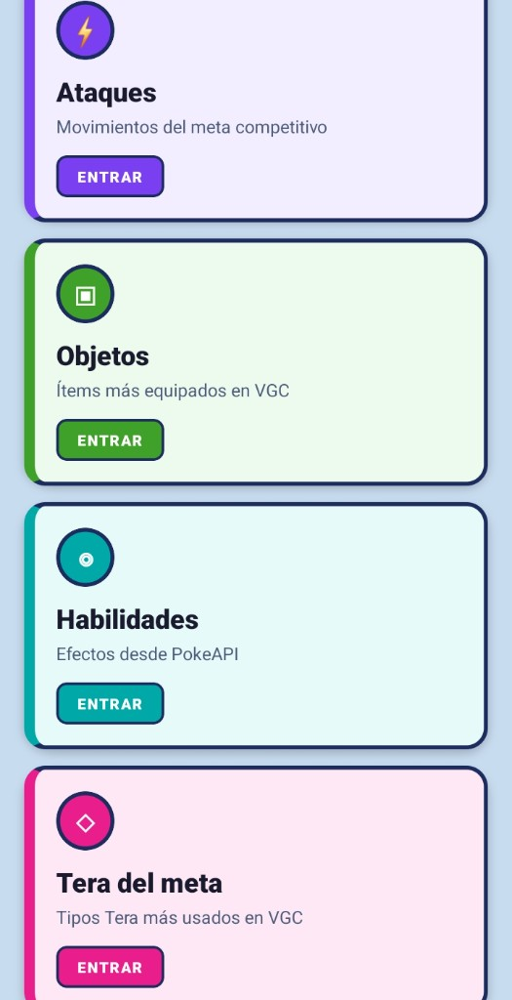 |

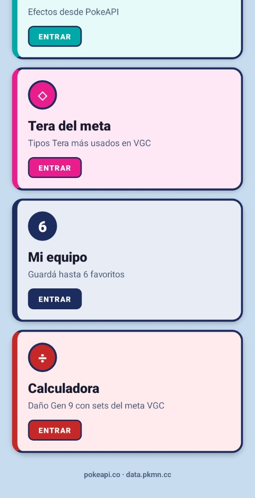

Punto de entrada de **PokéMeta**. Muestra el branding Champions / Gen 9, una barra de **búsqueda global** (Pokémon, meta, movimientos, objetos, habilidades) y una cuadrícula de **9 modos**: Pokédex, Meta y sets, Tipos, Ataques, Objetos, Habilidades, Tera del meta, Mi equipo y Calculadora. El meta se precarga en segundo plano para abrir listas más rápido.

---

### Pokédex

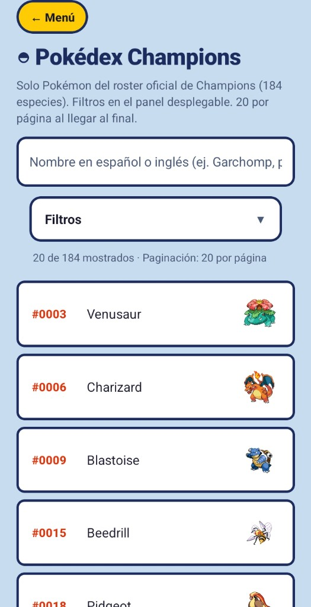

Listado del **roster oficial de Pokémon Champions** (~184 especies). Incluye búsqueda en español, filtros por generación, tipo, hábitat, color y fase evolutiva, y paginación. Al tocar una especie se abre la ficha con stats, tipos, evolución, movimientos y enlaces al meta si está en uso competitivo.

---

### Meta y sets (Champions)

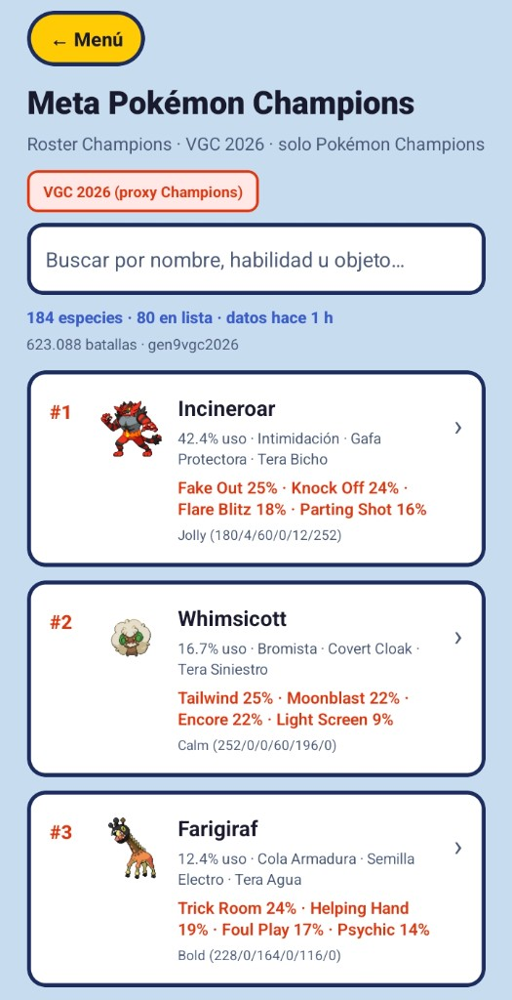

Ranking de uso competitivo basado en **VGC 2026** (proxy hasta formato `championsou` dedicado), filtrado al roster Champions. Muestra porcentaje de uso, movimientos, objeto y habilidad más populares, con pull-to-refresh y caché offline. El detalle de cada entrada incluye spreads de EVs, movimientos, Tera y export a formato **Pokémon Showdown**.

---

### Tipos

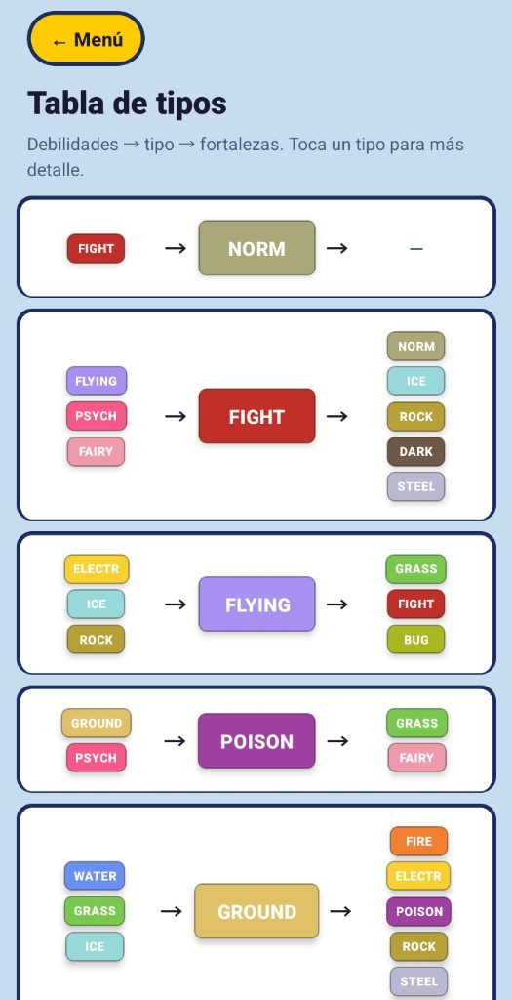

Guía visual de **matchups**: por cada tipo se ven debilidades y fortalezas en una sola fila. Al pulsar un tipo se abre el detalle con radar de efectividad y explicación desde PokeAPI.

---

### Ataques

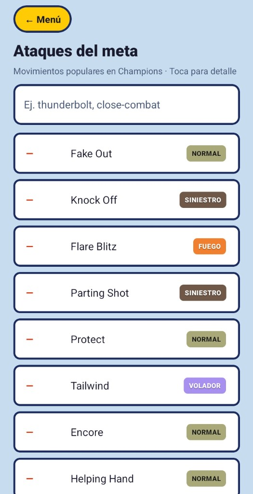

Movimientos más usados en el meta VGC Champions: tipo, categoría, potencia y frecuencia de uso. Permite abrir el detalle del movimiento y ver qué Pokémon del meta lo llevan; desde ahí se puede saltar a la calculadora de daño.

---

### Objetos

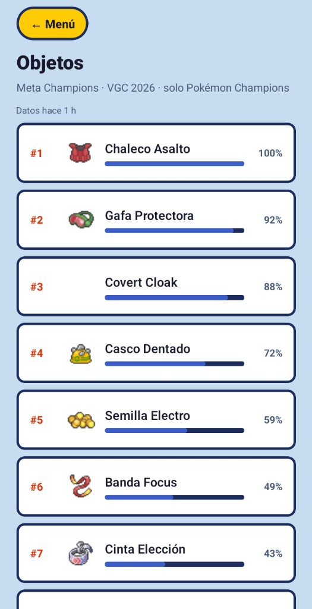

Objetos más equipados en sets competitivos (Chaleco Asalto, Gafa Protectora, etc.) con descripción en español vía PokeAPI y ranking por uso en el meta.

---

### Habilidades

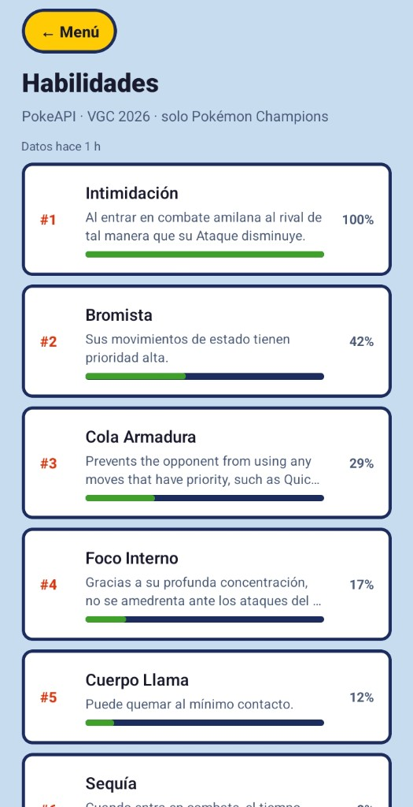

Listado de habilidades relevantes en VGC Champions, ordenadas por popularidad, con el texto de efecto traducido y enlace a Pokémon que las usan en el meta.

---

### Teracristalización (Tera del meta)

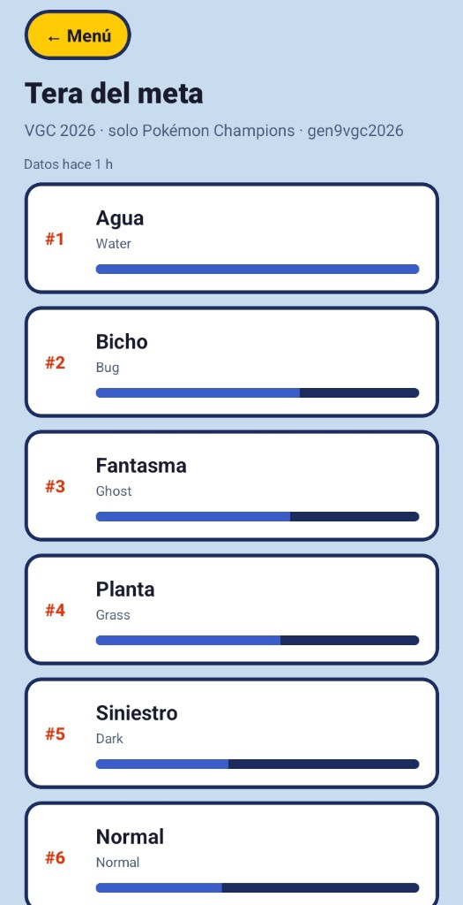

Distribución de **tipos Tera** en los sets del meta: qué Teras son más frecuentes por especie y en el formato en general. Útil para anticipar coberturas defensivas y ofensivas en combate doble.

---

### Mi equipo

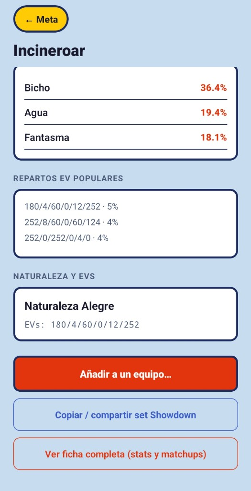

Hasta **6 Pokémon por equipo**, con varios equipos guardados en el dispositivo (AsyncStorage). Desde la ficha o el meta podés añadir especies y elegir a qué equipo van. La pantalla de equipo incluye:

- Análisis de tipos (debilidades compartidas, cobertura ofensiva)
- **Speed tiers** entre miembros
- Reordenar slots, renombrar equipos y **exportar a Showdown**

---

### Calculadora de daño (Gen 9)

| Elegir atacante, defensor y movimiento | Resultado del cálculo |
|:---:|:---:|
| 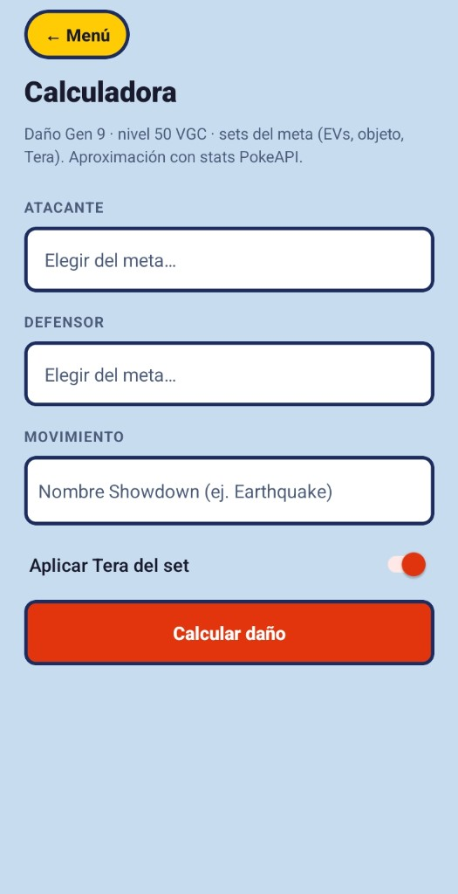 | 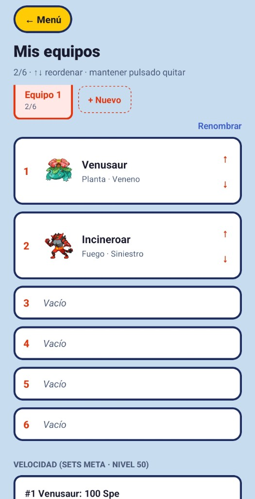 |

Motor de daño **Gen 9** con sets del meta VGC: elegís atacante y defensor desde el ranking Smogon, movimiento, y opciones como crítico, clima o Terastal. Muestra daño mínimo/máximo, porcentaje de PS y posibilidad de OHKO/2HKO. Se puede abrir pre-rellenada desde un movimiento o desde el detalle de meta.

---

## Fuentes de datos

- [PokeAPI](https://pokeapi.co) — especies, movimientos, habilidades, objetos, i18n
- [data.pkmn.cc](https://data.pkmn.cc) — estadísticas Smogon (`gen9vgc2026`)

El meta actual es un **proxy VGC 2026** filtrado al roster Champions hasta que exista un formato dedicado (`championsou`) en data.pkmn.cc.

## Desarrollo

```bash
npm install
npx expo start
npm test
npx tsc --noEmit
```

## Generar APK (Android)

Con [EAS Build](https://docs.expo.dev/build/setup/) (cuenta Expo gratuita):

```bash
npm install -g eas-cli
eas login
eas build --platform android --profile preview
```

Al terminar, EAS da un enlace para descargar el `.apk`. El perfil `preview` genera APK instalable (no AAB de Play Store).

Build local (requiere Android SDK + Java):

```bash
eas build --platform android --profile preview --local
```

## Mejoras recientes

- Calculadora de daño Gen 9 con sets del meta VGC (motor nativo + PokeAPI)
- Búsqueda global · speed tiers en equipo · elegir equipo al guardar
- Análisis de equipo (debilidades compartidas, cobertura ofensiva)
- Export Showdown desde meta y equipo
- Búsqueda ES en Pokédex, lazy i18n en lista meta
- Stale-while-revalidate en stats Smogon
- Índices PokeAPI persistidos en AsyncStorage

## Caché

Stats Smogon, roster Champions, nombres ES y mapa evolutivo en AsyncStorage (TTL 24 h). Stats usan stale-while-revalidate offline. Pull-to-refresh invalida datos Smogon.
